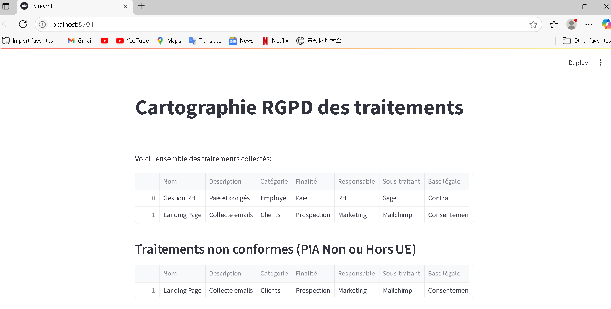

# cartographie-rgpd-dashboard
Outil de visualisation de traitements RGPD avec tableaux de bord et indicateurs de conformité

# Cartographie RGPD Dashboard

Ce projet est un tableau de bord interactif (Python/Streamlit) permettant de :
- Recenser les traitements de données personnelles dans une organisation
- Visualiser la conformité RGPD (PIA, bases légales, localisation…)
- Générer des rapports sur les traitements à risque ou non conformes

## Fonctionnalités
- Listing dynamique des traitements
- Mise en évidence des non-conformités RGPD (PIA manquant, données hors UE…)
- Import/export de jeux de données (.csv)
- Génération de rapports PDF/CSV

## Démonstration



## Utilisation rapide

1. Clone ou télécharge ce repo.
2. Installe Python 3.x puis les dépendances :
    ```
    pip install -r requirements.txt
    ```
3. Lance le dashboard :
    ```
    cd src
    streamlit run app.py
    ```
4. Accède à [http://localhost:8501](http://localhost:8501)

## Structure des données

Fichier CSV attendu (`data/traitements.csv`) :

| Nom           | Description       | Catégorie | Finalité   | Responsable | Sous-traitant | Base légale | PIA | Localisation |
|---------------|------------------|-----------|------------|-------------|---------------|-------------|-----|--------------|
| Gestion RH    | Paie & congés    | Employé   | Paie       | RH          | Sage          | Contrat     | Oui | France       |
| Landing Page  | Collecte emails  | Clients   | Prospection| Marketing   | Mailchimp     | Consentement| Non | USA          |
...

## Licence

MIT

## Auteur

Anthony Biyele
